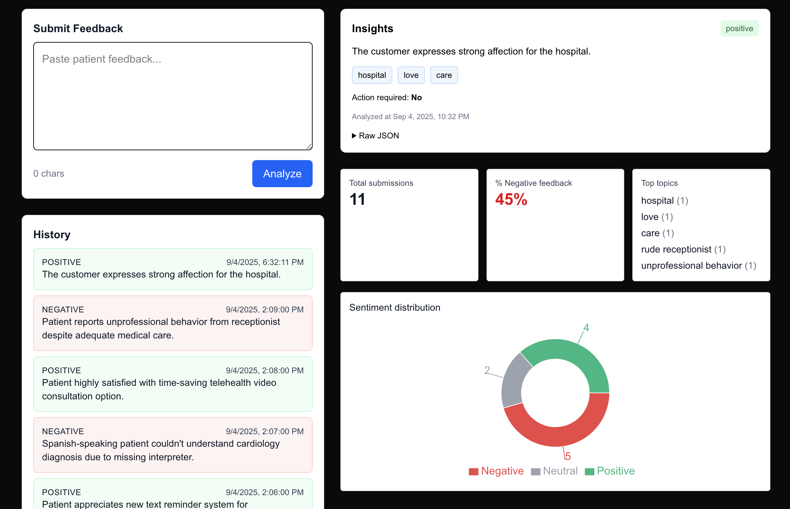

# Patient Feedback Analyzer with AI

This is a dashboard for analyzing patient feedback with AI. It uses OpenAI in the backend.

---

## Screenshot



## How to Run

1. Install dependencies (use `pnpm` to make it faster):

   ```bash
   pnpm install
   ```

2. Add an OpenAI API key in `.env` (make sure to put in .gitignore)

   ```
   OPENAI_API_KEY=...
   ```

   If no key is set, the app uses a simple mock analyzer.

3. Start the dev server:

   ```bash
   pnpm run dev
   ```

4. Open [http://localhost:3000](http://localhost:3000) in a browser.

---

## What It Does

Allows patients to submit feedback on their physicians, the hospital environment, etc. It then analyzes these comments and provides a sentiment analysis. It stores a history of all feedback and surfaces key insights from the data. 

It saves each submission in a JSONL file (`data/feedback.jsonl`). This was a quick way to persist data without setting up a real database.

---

## What I prioritized and why

* Made sure the whole loop works: input box -> API -> analysis with ChatGPT -> history → show on UI.
* Used Tailwind to make it look good quickly
* Added a couple of metrics to show how usage data could be summarized.


## What I’d Do With 1 More Hour

* Add CSV or JSON import of patient feedback (have to manually paste in right now)
* Switch from file storage to an actual database like Supabase so metrics are easier to query
* Make metrics prettier / add more metrics

---

## Security / Compliance Notes

* Remove any personally identifiable information before sending to LLM, so that the person submitting feedback can't be identified.
* Data at rest and in transit should be encrypted.
* Retention and deletion policies should be clear and enforced.
* Avoid storing raw text when possible. Structured insights may be enough.

---

## Possible Future Metrics

* Negative sentiment % over time (is it rising?)
* Topics most often linked to negative sentiment (what's causing the most complaints?)
* What percentage of feedback is actually actionable? (could maybe even use LLM to identify action items)
